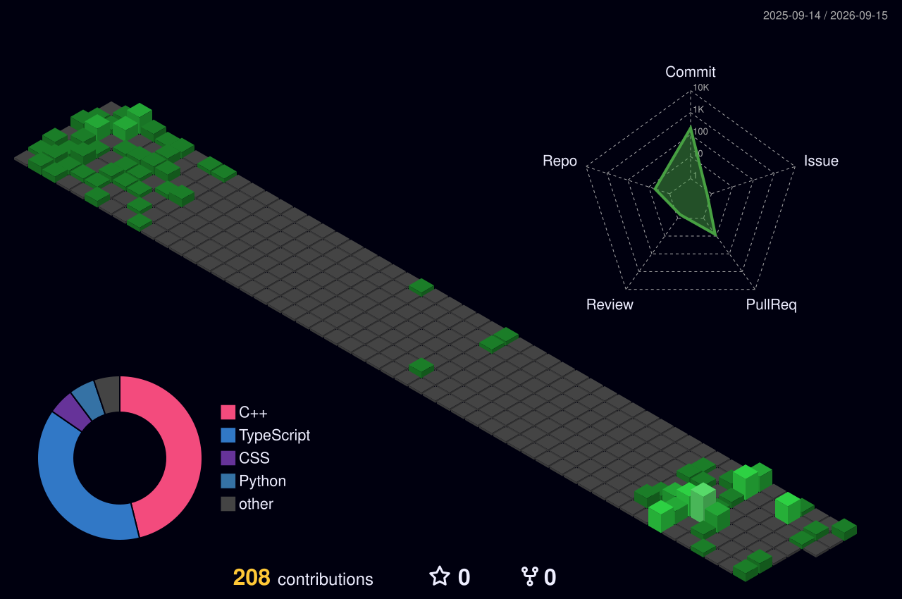

<h1 align="center">Hi, I'm Junhyuk Shin 👋</h1>

  <b>Computer Science @ Inha University</b>
   
  AI Engineer in Progress

  AI Engineering · LLMs · Backend

---

### 👨‍💻 About Me

- 🎓 Undergraduate Computer Science student at **Inha University**
- 🤖 Interested in **AI Engineering, LLMs, and Backend Development**
- 🧠 Learning AI through both **theory and implementation**
- 🛠️ Building small projects to understand how things actually work

 

### 🚀 Featured Projects

| Project | Description | Stack |
|---|---|---|
| 🪖 **[Airforce Calendar](https://github.com/ldrugsnw/airforce_calandar)** | A mobile-friendly leave management service for ROK Air Force personnel | React · TypeScript |
| 📄 **[MyArxiv](https://github.com/ldrugsnw/myarXiv)** | Search and explore arXiv papers through a simple web interface | FastAPI · React · TypeScript |
| 🖼️ **[Image Compressor](https://github.com/ldrugsnw/image_compressor)** | Compress images toward a target file size | FastAPI · React · Pillow |
| 📰 **[Stock News Analyzer](https://github.com/ldrugsnw/stock_news_analyze)** | Analyze financial news sentiment and importance using AI | Python · Gemini · RSS |
| 🧠 **[From Scratch LLM](https://github.com/ldrugsnw/from_scratch_LLM)** | Learning language models by implementing core concepts | Python · PyTorch |

 

### 🛠️ Tech Stack

**Languages**

**AI / ML**

**Backend / Web**

**Tools**

 

### 📚 Currently Learning

`Deep Learning` · `AI Engineering` · `Computer Systems` · `Operating Systems` · `Computer Networks`

 

### 🌱 Contributions

 

### 🧭 Experience

| Period | Experience |
|---|---|
| 2024.06 – 2025.06 | Technical Team, **IGRUS** |
| 2024.08 – 2024.12 | Vice President, **IGRUS** |
| 2024.12 – 2025.06 | President, **IGRUS** |
| 2025.11 – 2027.08 | Republic of Korea Air Force |

 

### 🧩 Algorithm

 

### 📫 Contact

**Email** · sonjhshin@gmail.com  
**Instagram** · @ldrugsnw
